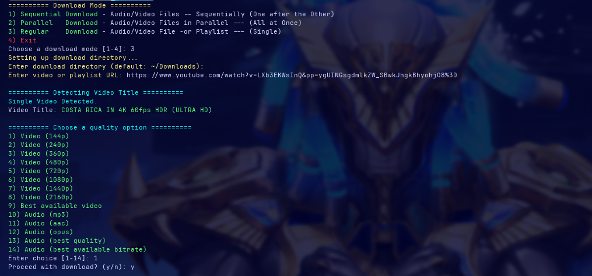

<p align="center">
  <h1 align="center">ytdl</h1>
  <p align="center">ytdl is a feature-rich interactive wrapper around yt-dlp</p>
  
  <p align="center">
    <a href="LICENSE">
      
    </a>
    
    
    
    
  </p>
</p>

## 📸 Screenshots

<p align="center">
  
  <br><em>YTDL All Download Modes</em>
</p>

<p align="center">
  
  <br><em>YTDL Overview Look</em>
</p>

<p align="center">
  
  <br><em>YTDL Quality Options & Downloading Log</em>
</p>

<p align="center">
  
  <br><em>YTDL Detecting Video Title and listing it and Showing Download Path</em>
</p>

<p align="center">
  
  <br><em>YTDL Sequential Download Mode</em>
</p>

<p align="center">
  
  <br><em>YTDL Parallel Download Mode</em>
</p>

---

# ytdl - Interactive YouTube Downloader (yt-dlp Wrapper)

`ytdl` is a feature-rich interactive wrapper around `yt-dlp`, designed for a better video downloading experience from YouTube and other platforms. It provides smart quality selection, playlist support, parallel/sequential downloading, and colorful output.

---

## 🚀 Features

- Supports single video and full playlist downloads
- Parallel and sequential batch modes
- Interactive quality selection (144p–4K or best)
- Progress tracking and clear console output
- Embedded metadata and thumbnails
- Internet connectivity retry logic
- External downloader support (aria2c)
- Colorful and user-friendly interface
- Safe, extensible, and lightweight (Bash only)

---

## ⚙️ How It Works (Key Features)

- Uses `yt-dlp` and `aria2c` for robust downloads
- Detects playlists and prompts for full vs single video
- Detects titles and fetches playlist info with `jq`
- Reattempts download if no internet
- Temporary URLs list file is auto-deleted after use

---

## 🧠 Command Workflow

1. Select mode: single, sequential, or parallel
2. Enter video URL or batch list
3. Choose video quality
4. Select download location
5. Download begins with retry + progress output

---

## 📦 Usage Examples

```bash
ytdl
````

Launch interactive downloader

```bash
ytdl.sh
```

Run locally from repo

```bash
curl -fsSL https://raw.githubusercontent.com/codewithmoss/ytdl/main/install.sh | bash
```

One-line install and run

---

## 🧵 Summary of Workflow

* Choose download mode
* Paste video URLs or playlist
* Select quality + output directory
* Let `ytdl` handle the rest

---

## 🔧 Installation

## 📌 Requirements

* `yt-dlp`
* `aria2c`
* `jq`
* `tput` (optional but enhances UI)

### Manual (clone repo)

```bash
git clone https://github.com/codewithmoss/ytdl.git
cd ytdl
chmod +x ytdl.sh
sudo cp ytdl.sh /usr/local/bin/ytdl
```

### Arch Linux (AUR)

If you use an AUR helper like `yay` or `paru`:

```bash
yay -S ytdl
```

or

```bash
paru -S ytdl
```

Or manually clone and build:

```bash
git clone https://aur.archlinux.org/ytdl.git
cd ytdl
makepkg -si
```
✅ Now you can use ytdl anywhere!

### CURL (simple install script)

```bash
curl -fsSL https://raw.githubusercontent.com/codewithmoss/ytdl/main/install.sh | bash
```

> This will automatically download `ytdl.sh` and place it into `/usr/local/bin/`.

#### How it works

* Fetches the latest `ytdl.sh` script from GitHub
* Installs to `/usr/local/bin/ytdl` and makes it executable

---

## 📝 License

This project is licensed under the [MIT License](LICENSE).

---

## 🤝 Contributing

Contributions are welcome! Feel free to open issues or pull requests to improve features, fix bugs, or suggest enhancements.

---

## 📬 Contact

Made with ☕ and 🔥 by [RAI SULEMAN](https://github.com/codewithmoss)

---